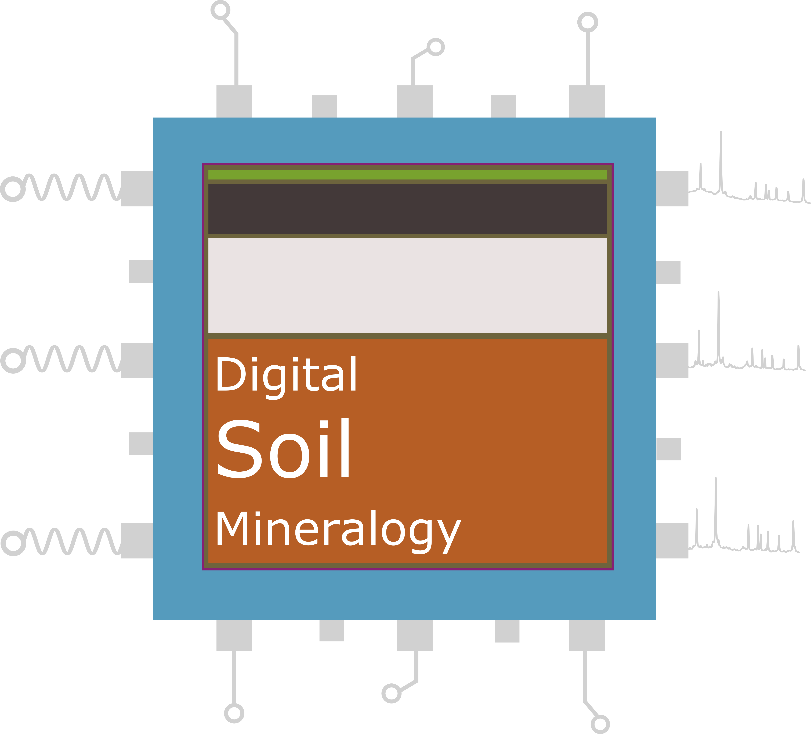

  
  
  

# **Digital Soil Mineralogy**
      
### *Data-driven analysis of XRPD data* {style="padding-top: 0px;"}
      
Analysis of soils by X-ray powder diffraction (XRPD) allows accurate identification and quantification of soil mineral components, with Hutton Scientists [world leading](https://www.hutton.ac.uk/news/hutton-team-declared-best-world-clay-mineralogy) in their XRPD methods and expertise. In recent years national scale XRPD datasets have become available, allowing new digital, data-driven approaches to be undertaken. Research by the Digital Soil Mineralogy group at the James Hutton Institute has proven that the application of [data mining](https://www.sciencedirect.com/science/article/pii/S0016706117317007) and [cluster analysis](https://www.sciencedirect.com/science/article/pii/S0016706118307651) to these XRPD datasets can offer new insights into the way minerals contribute to the many properties and functions of soil. This website showcases the latest advances in Digital Soil Mineralogy, including publications, software, and web applications.
    

  

