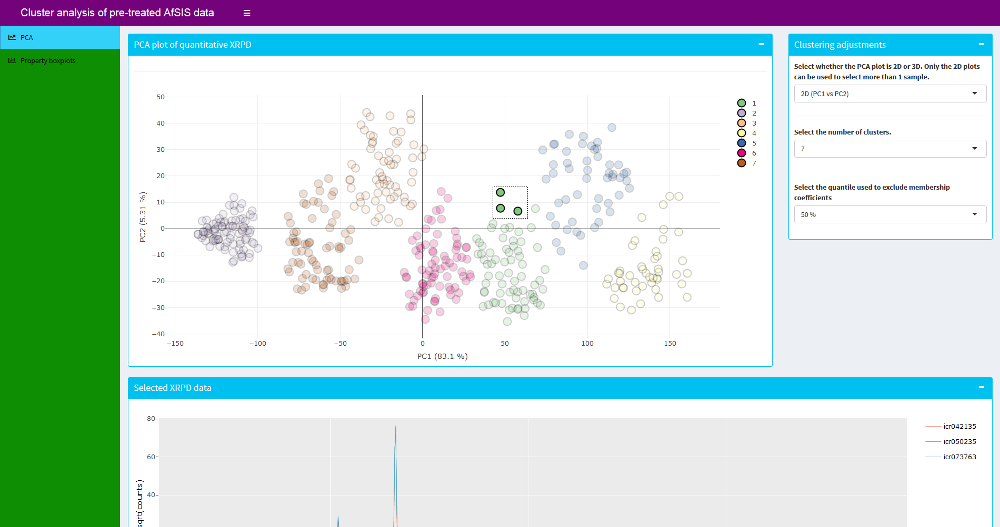
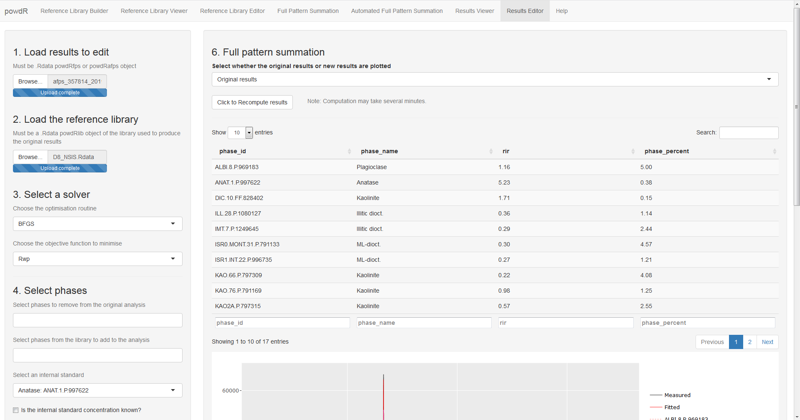

  
  

## **Web applications for Digital Soil Mineralogy**

The `shiny` package of the `R` programming language provides a powerful framework for creating interactive web applications that allow the user to visualise and analyse data in innovative ways. Here two examples are provided that illustrate the capability of such applications for Digital Soil Mineralogy.

---

### **Cluster analysis of African soil XRPD data**

This web application allows the user to apply cluster analysis to XRPD data of approximately 940 African soils. Cluster analysis from soil XRPD data seeks to form groups of soils that are mineralogically similar to one-another, but mineralogically distinct from other clusters. The application allows the user to visualise the derived clusters spatially and according to the variation in soil properties. Click on the screenshot below to load the web application.

<a href="http://digitalmineralogy.hutton.ac.uk/AfSIS">
</a>

---

### **The `powdR` web application**

To supplement the `powdR` package, a web application has been developed to facilitate user-friendly and iterative analysis. Video tutorials for use of the web application can be found in the "Help" tab. Click on the screenshot below to load the web application.

<a href="http://digitalmineralogy.hutton.ac.uk/powdR">
</a>
